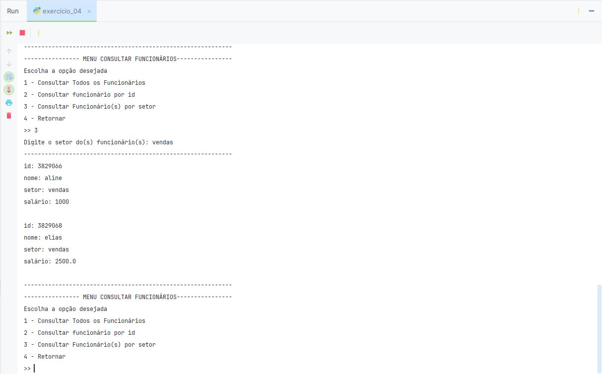

# Atividade Prática de Lógica de Programação e Algoritmos

### Função Decoradora Para Inputs
Esta função realiza chamadas recursivas quando dados inválidos são inseridos pelo usuário, evitando a interrupção
do programa, a menos que o número máximo de chamadas recursivas seja atingido.
```python
from typing import Any


def decorador_input(funcao):
    def __envolucro(rotulo: str = '\n=> ', chamadas: int = 5, *args, **kwargs) -> Any:
        """
        Função de decoradora para 'inputs'.
        :param rotulo: Descrição da entrada de dados.
        :param chamadas: Número máximo de chamadas recursivas.
        :return: Valor de entrada validado.
        """
        _entrada = funcao(input(rotulo), *args, **kwargs)
        if _entrada is None:
            if chamadas > 0:
                return __envolucro(rotulo, chamadas - 1, *args, **kwargs)
            else:
                raise RuntimeError('<function: entrada> - Limite de chamadas recursivas atingido.')
        return _entrada

    return __envolucro

```

## Questão 01

Desenvolver um app para uma determinada estratégia de venda a prazo, onde juros serão determinados pelo número
de parcelas requeridas, obedecendo a seguinte orientação:

- Número de parcelas **menor** que 4, juros = 0%
- Número de parcelas **igual ou maior** a 4 e **menor** que 6, juros = 4%
- Número de parcelas **igual ou maior** a 6 e **menor** que 9, juros = 8%
- Número de parcelas **igual ou maior** a 9 e **menor** que 13, juros = 16%
- Número de parcelas **igual ou maior** a 13, juros = 32%

### Exigências:
1. Implementar exibição do nome completo do acadêmico.
2. Implementar a entrada de dados para valor do pedido e quantidade de parcelas.
3. Implementar estrutura condicional para os juros utilizando os operadores (menor que, maior que, igual ou maior que).
4. Implementar o valor da parcela e o valor total parcelado.
5. Implementar estrutura condicional *if, elif e else*.
6. Inserir comentários relevantes.
7. Implementar uma saída de console apresentando o valor da parcela e o total parcelado.

### Código:
```python
from decorador import decorador_input


@decorador_input
def input_loja(descricao: str, retorna_inteiro: bool = False) -> float | int:
    """
    EXIGÊNCIA DO CÓDIGO N.º 1 - input para entrada de dados numéricos.
    """
    try:
        _entrada: float = float(descricao)

    except ValueError:
        print('Entrada de dados inválida. Apenas valores numéricos são aceitos!')
    else:
        return _entrada if not retorna_inteiro else int(_entrada)


def processar_pedido(valor_do_pedido: float, quantidade_parcelas: int) -> list:
    """
    EXIGÊNCIA DO CÓDIGO N.º 2 - variáveis valor_do_pedido e quantidade_parcelas como parâmetros de função.
    EXIGÊNCIA DO CÓDIGO N.º 3 e 5 - Juros e estrutura if, elif e else.
    EXIGÊNCIA DO CÓDIGO N.º 4 - variáveis valor_da_parcela e valor_total_parcelado.
    """
    if 4 <= quantidade_parcelas < 6:
        juros = 0.04
    elif 6 <= quantidade_parcelas < 9:
        juros = 0.08
    elif 9 <= quantidade_parcelas < 13:
        juros = 0.16
    elif quantidade_parcelas >= 13:
        juros = 0.32
    else:
        juros = 0
    valor_da_parcela = valor_do_pedido * (1 + juros) / quantidade_parcelas
    valor_total_parcelado = valor_da_parcela * quantidade_parcelas
    return [
        f'R$ {valor_da_parcela:.2f}'.replace('.', ','),
        f'R$ {valor_total_parcelado:.2f}'.replace('.', ',')
    ]


def executar() -> None:
    print('Bem-Vindo a loja de Artur dos Santos Shon')
    mensagem = 'O valor das parcelas é de: {}\nO valor Total Parcelado é de: {}'.format(
        *processar_pedido(
            valor_do_pedido=input_loja('Entre com o valor do pedido: '),
            quantidade_parcelas=input_loja('Entre com a quantidade de parcelas: ', True)
        )
    )
    print(mensagem)


if __name__ == '__main__':
    executar()

```

### Saída do console:
<div style="width: 100%; margin: 0 auto;">
    
</div>

## Questão 02

Desenvolver uma aplicação para a venda de marmitas com as opções de Bife Acebolado ou Filé de Frango. 
Observar a seguinte relação:

- Tamanho P de Bife Acebolado (BA) custa 16 reais e o Filé de Frango (FF) custa 15 reais;
- Tamanho M de Bife Acebolado (BA) custa 18 reais e o Filé de Frango (FF) custa 17 reais;
- Tamanho G de Bife Acebolado (BA) custa 22 reais e o Filé de Frango (FF) custa 21 reais;

### Exigências:
1. Implementar o print com o seu nome completo e um menu para o cliente. 
2. Implementar o input do sabor (BA/FF) com mensagem para escolhas incorretas.
3. Implementar o input do tamanho (P/M/G) com mensagem para escolhas incorretas.
4. Implementar *if, elif e/ou else*, utilizando o modelo aninhado (Substituído deliberadamente pela a 
utilização do operador **in** sobre uma estrutura iterável (*list*)).
5. Implementar um acumulador para somar os valores dos pedidos.
6. Implementar o input com a pergunta: “Deseja pedir mais alguma coisa?”. Se sim repetir a partir do item 2, 
senão encerrar o programa exibir o resultado do acumulador.
7. Implementar as estruturas de *while, break, continue* (todas elas).
8. Inserir comentários relevantes no código.

### Código:
```python
from decorador import decorador_input
from typing import Literal, List


@decorador_input
def input_marmitas(descricao: str, tipo: Literal['sabor', 'tamanho', 'continuar']) -> str:
    """
    EXIGÊNCIA DO CÓDIGO N.º 2, 3 e 8 - input para tamanho, sabores e continuar.
    EXIGÊNCIA DO CÓDIGO N.º 4 - estrutura 'if else' aninhada descontinuada pelo operador 'not in' aplicado
    sobre uma estrutura de dados iterável (opcoes).
    """
    try:
        opcoes = {
            'sabor': ['ba', 'ff'],
            'tamanho': ['p', 'm', 'g'],
            'continuar': ['s', 'n'],
        }
        msg_erro = "{} inválido. Tente Novamente.\n"
        _input = descricao
        if _input not in opcoes.get(tipo):
            raise ValueError(msg_erro.format(tipo.title() if tipo not in 'continuar' else 'Opção'))
    except ValueError as erro:
        print(erro)
    else:
        return _input.lower()


def cardapio() -> dict:
    item_1 = {'nome': 'Bife Acebolado', 'tamanhos': {'p': 16, 'm': 18, 'g': 22}}
    item_2 = {'nome': 'Filé de Frango', 'tamanhos': {'p': 15, 'm': 17, 'g': 21}}
    preco_item_1 = [f'R$ {i:.2f}' for i in item_1['tamanhos'].values()]
    preco_item_2 = [f'R$ {i:.2f}' for i in item_2['tamanhos'].values()]
    print(
        f'{" Bem-vindo a loja de Marmitas do Artur dos Santos Shon ":-^60}',
        f'{"Cardápio":-^60}',
        '-' * 60,
        f'{f"|{'Tamanho':^10}|{'Bife Acebolado(BA)':^20}|{'Filé de Frango(FF)':^20}|":-^60}',
        f'{f"|{'P':^10}|{preco_item_1[0]:^20}|{preco_item_2[0]:^20}|":-^60}',
        f'{f"|{'M':^10}|{preco_item_1[1]:^20}|{preco_item_2[1]:^20}|":-^60}',
        f'{f"|{'G':^10}|{preco_item_1[2]:^20}|{preco_item_2[2]:^20}|":-^60}',
        '-' * 60,
        sep='\n'
    )
    return dict(ba=item_1, ff=item_2)


def executar() -> None:
    # EXIGÊNCIA DO CÓDIGO N.º 5 - como acumulador foi escolhida uma estrutura de dados do tipo lista.
    total, itens = list(), cardapio()
    # EXIGÊNCIA DO CÓDIGO N.º 7 - Estrutura while, continue e break.
    while True:
        sabor = input_marmitas('Entre com o sabor desejado (BA / FF): ', tipo='sabor')
        tamanho = input_marmitas('Entre com o tamanho desejado (P / M / G): ', tipo='tamanho')
        pedido = [itens[sabor]['nome'], itens[sabor]['tamanhos'][tamanho]]
        total.append(pedido[1])
        print(f'Você pediu um {pedido[0]} no tamanho {tamanho.upper()}: R$ {pedido[1]:.2f}')
        if input_marmitas('\nDeseja mais alguma coisa? (S / N): ', tipo='continuar') in 's':
            continue
        else:
            break
    # EXIGÊNCIA DO CÓDIGO N.º 6 - exibir a soma dos valores acumulados.
    print(f'\nO valor total a ser pago: R$ {sum(total):.2f}'.replace('.', ','))


if __name__ == '__main__':
    executar()

```

### Saída do console:
<div style="width: 100%; margin: 0 auto;">
    
</div>

## Questão 03

Desenvolver um sistema de cobrança de serviços de uma fábrica que vende Camisetas em atacado.
Observar a seguinte relação:

- Camiseta Manga Curta Simples (MCS), o valor unitário é de R$ 1,80.
- Camiseta Manga Longa Simples (MLS), o valor unitário é de R$ 2,10.
- Camiseta Manga Curta Com Estampa (MCE), o valor unitário é de R$ 2,90.
- Camiseta Manga Longa Com Estampa (MLE), o valor unitário é de R$ 3,20.
- Se número de camisetas for **menor** que 20 não há desconto na venda.
- Se número de camisetas for **igual ou maior** que 20 e **menor** que 200, o desconto será de 5%.
- Se número de camisetas for **igual ou maior** que 200 e **menor** que 2000, o desconto será de 7%.
- Se número de camisetas for **igual ou maior** que 2000 e **menor ou igual** que 20000, o desconto será de 12%.
- Se número de camisetas for **maior** que 20000, **não** é aceito pedidos nessa quantidade de camisetas.
- Para o adicional de frete por transportadora (1) é cobrado um valor extra R$ 100,00.
- Para o adicional de frete por Sedex (2) é cobrado um valor extra de R$ 200,00.
- Para o adicional de retirar o pedido na fábrica (0) nenhum valor será cobrado.

### Exigências:
1. Deve-se implementar o print com o seu nome completo. 
2. Deve-se implementar a função escolha_modelo().
3. Deve-se implementar a função num_camisetas().
4. Deve-se implementar a função frete().
5. Deve-se implementar o total a pagar no código principal (main), ou seja, não pode estar dentro de função.
6. Deve-se implementar *try/except*.
7. Deve-se inserir comentários relevantes no código .

```python
from decorador import decorador_input
from typing import Literal, List


@decorador_input
def input_fabrica(descricao: str, tipo: Literal['int', 'str'], **kwargs) -> str | int:
    """
    EXIGÊNCIA DO CÓDIGO N.º 6 e 7 - implementar try/except e comentários relevantes.
    Função para entrada de dados.
    kwargs = {
        minmax = Lista de valores inteiros mínimos e máximos aceitos para inputs numéricos.
        opcao = Lista de valores do tipo string com as opções de camisas para menu.
    }
    """
    try:
        _entrada = int(descricao) if tipo in 'int' else descricao
        if isinstance(_entrada, int) and kwargs.get('minmax') is not None:
            if _entrada < kwargs.get('minmax')[0] or _entrada > kwargs.get('minmax')[1]:
                _entrada = None
        else:
            if _entrada.upper() not in kwargs.get('opcao'):
                _entrada = None
        if _entrada is None:
            raise ValueError(kwargs.get('msg_erro'))
        return _entrada
    except ValueError as erro:
        print(erro)


def escolha_modelo() -> int | float:
    # EXIGÊNCIA DO CÓDIGO N.º 2 - implementar a função escolha_modelo().
    msg_erro = str('Escolha inválida, entre com o modelo novamente.\n')
    modelos = {'MCS': 1.8, 'MLS': 2.1, 'MCE': 2.9, 'MLE': 3.2}
    opcoes = [i for i in modelos.keys()]
    menu = str('Entre com o modelo desejado:\n'
               '{} - Manga Curta Simples;\n'
               '{} - Manga Longa Simples;\n'
               '{} - Manga Curta Com Estampa;\n'
               '{} - Manga Longa Com Estampa;\n>> ')
    escolha = input_fabrica(menu.format(*opcoes), tipo='str', msg_erro=msg_erro, opcao=opcoes)
    return modelos.get(escolha.upper())


def num_camisetas() -> dict:
    # EXIGÊNCIA DO CÓDIGO N.º 3 - implementar a função num_camisetas().
    msg_erro = 'Não aceitamos tantas camisetas de uma vez.'
    paginas = input_fabrica(
        'Entre com o número de camisetas: ',
        tipo='int',
        minmax=[1, 20000 - 1],
        msg_erro=msg_erro
    )
    desconto = 0
    if 20 <= paginas < 200:
        desconto = 0.05
    elif 200 <= paginas < 2000:
        desconto = 0.07
    elif 2000 <= paginas <= 20000:
        desconto = 0.12
    return {'paginas': paginas, 'desconto': desconto}


def frete() -> int:
    # EXIGÊNCIA DO CÓDIGO N.º 4 - implementar a função frete().
    msg_erro = 'Opção extra inválida.'
    valores = {1: 100, 2: 200}
    menu = str(f'Escolha o tipo de frete:\n'
               f'1 - Frete por transportadora - R$ {valores.get(1):.2f}\n'
               f'2 - Frete por Sedex - R$ {valores.get(2):.2f}\n'
               f'0 - Retirar pedido na fábrica - R$ 0,00\n>> ')
    extra = input_fabrica(menu, tipo='int', minmax=[0, 2], msg_erro=msg_erro)
    return valores.get(extra) if extra else extra


if __name__ == '__main__':
    # EXIGÊNCIA DO CÓDIGO N.º 5 - implementar o total a pagar no código principal (main).
    print('Bem vindos a Fábrica de Camisetas do Artur dos Santos Shon\n')
    mensagem = 'Total: R$ %.2f ((serviço: R$ %.2f - desconto: %s) *  páginas: %d + extra: R$ %.2f)'
    servico = escolha_modelo()
    qtd = num_camisetas()
    extras = frete()
    total = (servico - (servico * qtd.get('desconto'))) * qtd.get('paginas') + extras
    total = mensagem % (total, servico, f'{int(qtd.get('desconto') * 100)}%', qtd.get('paginas'), extras)
    print(total.replace('.', ','))

```

### Saída do console:
<div style="width: 100%; margin: 0 auto;">
    
</div>

## Questão 04

Desenvolver uma aplicação de gerenciamento de funcionários. Este software deve ter o seguinte menu e opções:
- Cadastrar Funcionário
- Consultar Funcionário
   - Consultar Todos 
   - Consultar por Id
   - Consultar por setor
   - Retornar ao menu
- Remover Funcionário
- Encerrar Programa

### Exigências:
1. Implementar o print com o seu nome completo (somente print, não usar input aqui).
2. Implementar uma lista com o nome de lista_funcionarios e a variável id_global com valor inicial 
igual ao número de seu RU.
3. Implementar uma função chamada cadastrar_funcionario(id).
4. Implementar uma função chamada consultar_funcionarios().
   - Implementar menu secundário (1. Consultar Todos / 2. Consultar por Id / 3. Consultar por Setor / 4. Retornar ao menu):
   - Se Entrar com um valor diferente de 1, 2, 3 ou 4, exibir “Opção inválida".
   - Enquanto o usuário não escolher a opção 4, o menu consultar funcionários deve se repetir.
5. Implementar uma função chamada remover_funcionario().
   - Deve-se pergunta pelo id do funcionário a ser removido.
   - Remover o funcionário da lista_funcionarios.
   - Se o id fornecido não for de um funcionário da lista, exibir "ID Inválido"
6. Implementar uma estrutura de menu no código principal (main), ou seja, não pode estar dentro de função.
7. Deve-se implementar uma lista de dicionários (uma lista contento dicionários dentro).
8. Deve-se inserir comentários relevantes no código.

### Código:
```python
import json
from typing import List, Dict, Any
from decorador import decorador_input

# EXIGÊNCIA DO CÓDIGO N.º 2 - implementar uma lista com o nome de lista_funcionarios
# e a variável id_global com valor inicial igual ao número de seu RU.
id_global: int = 3829065
lista_funcionarios: List[Any] = list()

menu_consultar_funcionario = """Escolha a opção desejada
1 - Consultar Todos os Funcionários
2 - Consultar funcionário por id
3 - Consultar Funcionário(s) por setor
4 - Retornar
>> """

menu_remover_funcionario = """Deseja realmente remover o funcionário?
1 - Confirmar
2 - Cancelar
>> """

# EXIGÊNCIA DO CÓDIGO N.º 6 - Deve-se implementar uma estrutura de menu no código principal (main),
# ou seja, não pode estar dentro de função.
menu_principal = """Escolha a opção desejada:
1 - Cadastrar Funcionário
2 - Consultar Funcionários
3 - Remover Funcionário
4 - Sair
>> """


@decorador_input
def input_numerico(descricao: str, minn: int, maxx: int, decimal: bool = False) -> int | float:
    try:
        _entrada: float = float(descricao)
        if _entrada < minn or _entrada > maxx:
            raise Exception(f'Opção errada! O valor digitado deve estar entre {minn} e {maxx}.')
    except (ValueError, Exception) as err:
        if isinstance(err, ValueError):
            print('Opção errada! Apenas valores numéricos são aceitos')
        else:
            print(err)
    else:
        return _entrada if decimal else int(_entrada)


@decorador_input
def input_padrao(descricao: str) -> str:
    try:
        _entrada: str = str(descricao)
        if not _entrada.isprintable():
            raise ValueError
    except ValueError:
        print('Valor incorreto digitado!')
    else:
        return _entrada


def gerar_id():
    global id_global
    if len(lista_funcionarios) == 0:
        return id_global + 1
    return lista_funcionarios[-1]['id'] + 1


def exibir_dados_funcionarios(elementos: list) -> None:
    print('-' * 60)
    for item in elementos:
        print(
            f'id: {item.get("id")}',
            f'nome: {item.get("nome")}',
            f'setor: {item.get("setor")}',
            f'salário: {item.get("salario")}\n',
            sep='\n'
        )


def realizar_busca(_id: int = None, _setor: str = None) -> list:
    funcionarios = lista_funcionarios
    if _id:
        funcionarios = [item for item in funcionarios if item.get('id') == _id]
    elif _setor:
        funcionarios = [itens for itens in funcionarios if itens.get('setor') == _setor]
    return funcionarios


def cadastrar_funcionario(_id: int) -> dict:
    """
    EXIGÊNCIA DO CÓDIGO N.º 3 - implementar a função cadastrar_funcionario(id)
    :param _id: Número de id do novo funcionario.
    :return: Dict(nome, setor, salario)
    """
    print('-' * 60, f'{' MENU CADASTRAR FUNCIONÁRIO':-^60}', f'Id do Funcionário: {_id}', sep='\n')
    funcionario: Dict = dict(
        id=_id,
        nome=input_padrao('Por favor, entre com o nome do funcionário: '),
        setor=input_padrao('Por favor, entre com o setor do funcionário: '),
        salario=input_numerico('Por favor, entre com o salário do funcionário: ', minn=0, maxx=100000, decimal=True)
    )
    lista_funcionarios.append(funcionario)
    return funcionario


def consultar_funcionario() -> Any:
    """
    EXIGÊNCIA DO CÓDIGO N.º 4 - implementar uma função consultar_funcionarios().
    :return: Any
    """
    print('-' * 60, f'{' MENU CONSULTAR FUNCIONÁRIOS':-^60}', sep='\n')
    busca = list()
    escolha = input_numerico(menu_consultar_funcionario, minn=1, maxx=4)
    if escolha == 1:
        busca = realizar_busca()
    elif escolha == 2:
        busca = realizar_busca(_id=input_numerico('Digite o id do funcionário: ', minn=id_global, maxx=4000000))
    elif escolha == 3:
        busca = realizar_busca(_setor=input_padrao('Digite o setor do(s) funcionário(s): '))
    elif escolha == 4:
        return False
    exibir_dados_funcionarios(busca)
    return consultar_funcionario()


def remover_funcionario() -> None:
    """
    EXIGÊNCIA DO CÓDIGO N.º 5 - implementar uma função remover_funcionario().
    :return: None
    """
    print('-' * 60, f'{' MENU REMOVER FUNCIONÁRIO':-^60}', sep='\n')
    funcionario = realizar_busca(
        _id=input_numerico('Digite o id do funcionário a ser removido: ', minn=id_global, maxx=4000000)
    )
    if len(funcionario) != 0:
        print('Funcionário encontrado:')
        exibir_dados_funcionarios(funcionario)
        escolha = input_numerico(menu_remover_funcionario, minn=0, maxx=2)
        if escolha == 1:
            for i in range(0, len(lista_funcionarios)):
                if lista_funcionarios[i].get('id') == funcionario[0].get('id'):
                    lista_funcionarios.pop(i)
                    return
    else:
        print('Funcionário não encontrado!')


# Para utilização durante desenvolvimento

# with open('./funcionarios.json', encoding='utf8') as file:
#     lista_funcionarios = json.load(file)

if __name__ == '__main__':
    # EXIGÊNCIA DO CÓDIGO N.º 1 - print com o nome completo.
    print('Bem-Vindo a empresa de Artur dos Santos Shon')
    while True:
        print('-' * 60, f'{' MENU PRINCIPAL ':-^60}', sep='\n')
        # EXIGÊNCIA DO CÓDIGO N.º 6 - Deve-se implementar uma estrutura de menu no código principal (main),
        # ou seja, não pode estar dentro de função.
        escolha = input_numerico(menu_principal, minn=1, maxx=4)
        if escolha == 1:
            cadastrar_funcionario(gerar_id())
        elif escolha == 2:
            consultar_funcionario()
        elif escolha == 3:
            remover_funcionario()
        else:
            break

```

### Saída do console:

#### Realizando cadastro
<div style="width: 100%; margin: 0 auto;">
    
</div>

#### Consultando todos os funcionários
<div style="width: 100%; margin: 0 auto;">
    
</div>

#### Consultando Funcionário por ID
<div style="width: 100%; margin: 0 auto;">
    
</div>

#### Consultando Funcionário por setor
<div style="width: 100%; margin: 0 auto;">
    
</div>

#### Retornando ao menu principal
<div style="width: 100%; margin: 0 auto;">
    
</div>

#### Removendo um funcionário
<div style="width: 100%; margin: 0 auto;">
    
</div>

#### Exibindo os funcionários após a remoção
<div style="width: 100%; margin: 0 auto;">
    
</div>

#### Encerrando o programa
<div style="width: 100%; margin: 0 auto;">
    
</div>
